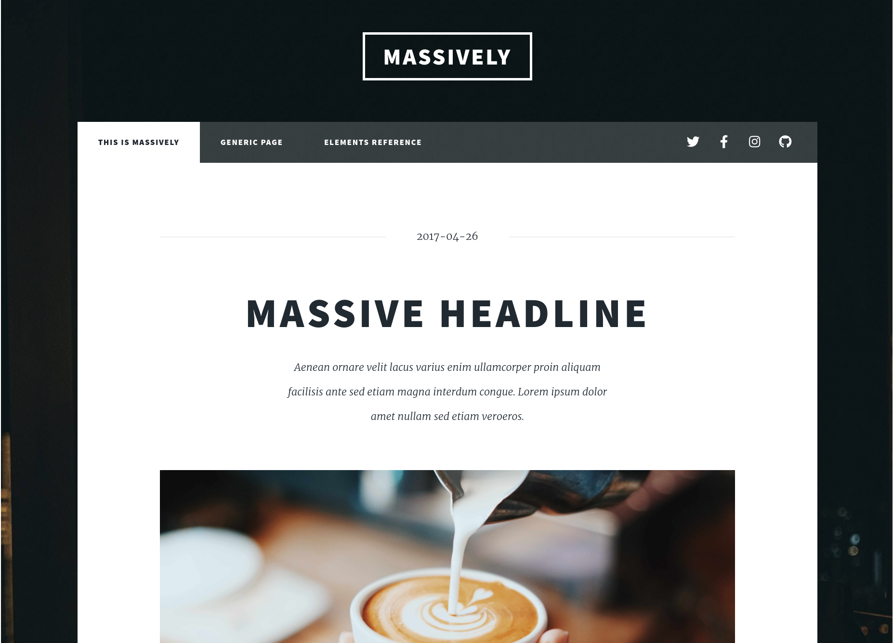
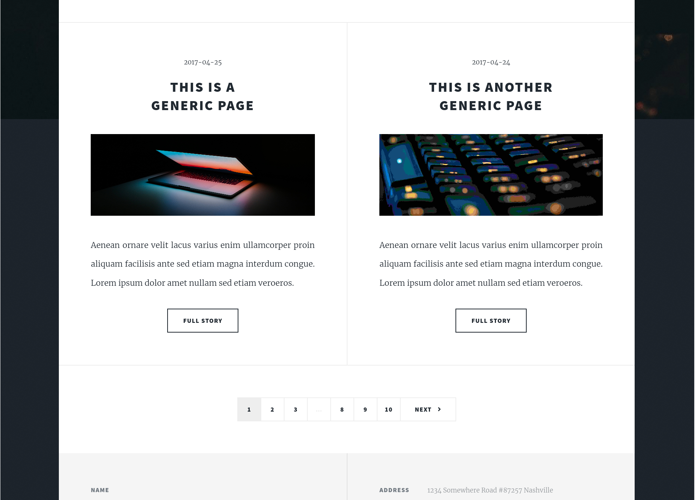
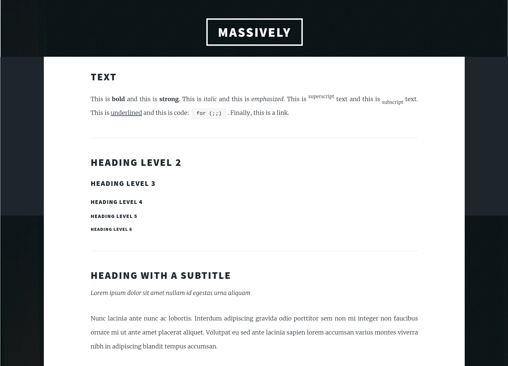
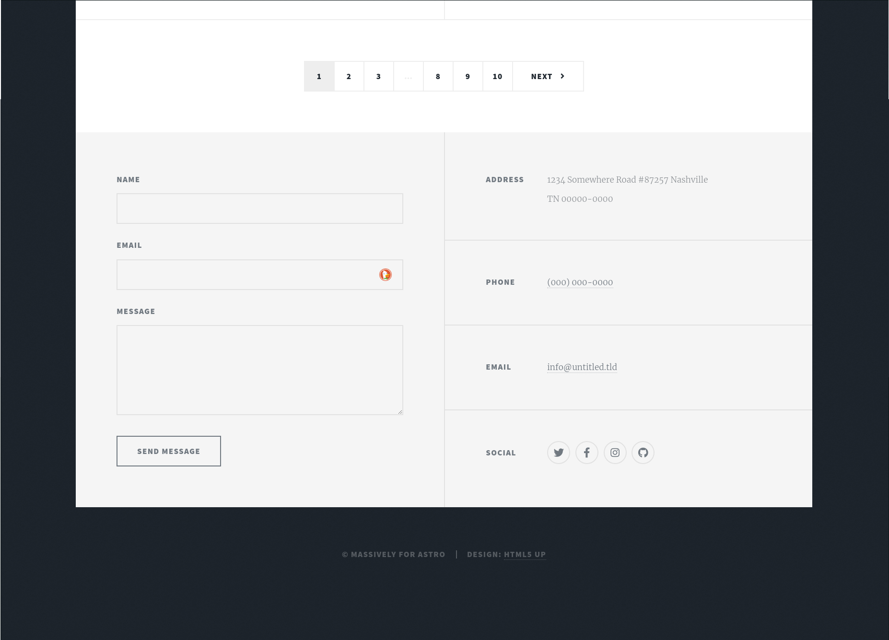
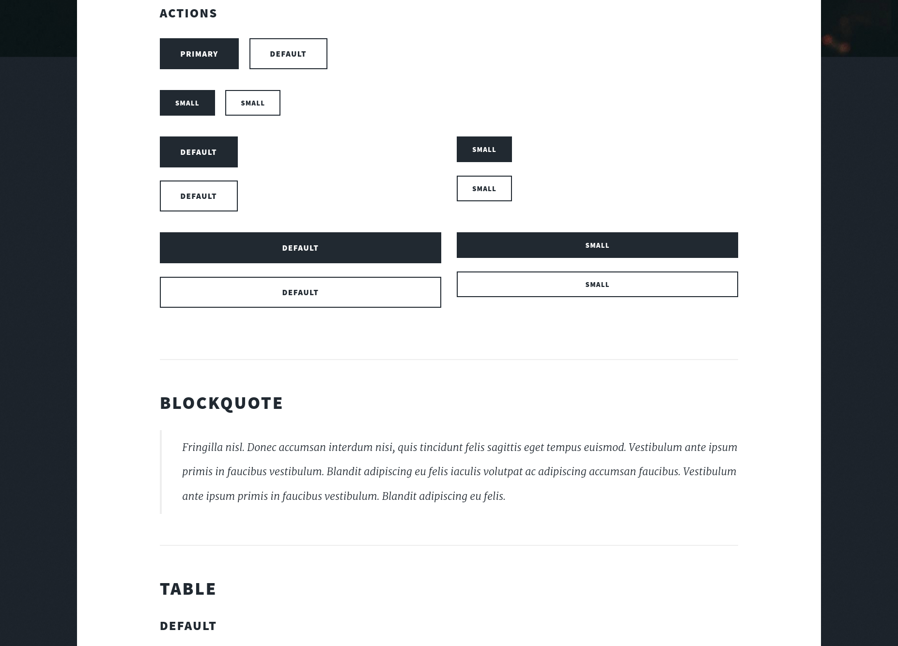

# Massively for Astro

Massively is a free, fully responsive HTML5 + CSS3 site template designed by [@ajlkn](https://twitter.com/ajlkn) for
[HTML5 UP](https://html5up.net) and released for free under the [Creative Commons license](https://html5up.net/license).
Remixed for [Astro](https://astro.build) by [@d_bozhinovski](https://twitter.com/d_bozhinovski).

This is a port of the template for Astro, to be used as a theme. It's been Astroized as much as I deemed practical. I
imagine it will need to change and evolve if there's interest in it, so I'm open to suggestions (and PRs) on how to
Astroize it further.

## [\[Click here for the Demo\]](https://astro-massively.darko.io)

  
  
  

  
  
  

---

## Quickstart

1. Run `npx degit https://github.com/DBozhinovski/astro-massively my-site-name` to get a "clean slate" copy of this
   repo.
2. Run `npm install` inside the cloned directory to install dependencies.
3. Customize and deploy!

## Features

- Easily customizable for many use cases
- Consistent look and feel
- Uses `astro 3.0.13` and should be able to support newer ones easily.
- Huge set of components to fit any type of site (see the `/elements` page)
- REALLY backward compatible - the design and styles were built a while ago :sweat_smile:
- Sitemap, RSS feed, Google Fonts Optimizer...

## Getting started

TL;DR; Clone -> install -> ? -> profit. Standard Astro stuff.

In addition to the run-of-the-mill Astro project structures, you can find a `/scripts` directory in `/src`. These are
the animation scripts ported over from the original theme. They enable some features, such as the parallax effect for
the intro header/logo transition. They can be easily disabled, however, if you'd like to have a JS-less page (see
below).

## General Configuration

Title, navigation links, social media links, URL etc. can be customized from the `./src/config.ts` file.

Changing these allows you to easily have a ready-to-deploy webpage without touching any code.

### A note on the logo

The logo past the intro animation is just the text of the web page's title (found inside `./src/config.ts`). If you need
to change that, it's enough to just add an image (or otherwise, customize the markup) in
`./src/components/IntroHeader.astro`. The element that needs it's markup changed is `<header id="header">...</header>`.

Any method of [importing images available in Astro](https://docs.astro.build/en/guides/images/) should do the trick.

## Development and customization notes

### Removing the animation for a fully static, zero JS site

The original template design has a jQuery-based 😧 parallax animation, that makes the site more of an eye-candy. Of
course, it looks fairly decent without that animation as well. Disabling it is pretty easy:

1. Remove all `<script>` tags from `./src/components/IntroHeader.astro`
2. Remove the conditional element that renders if there's an intro prop passed to the component.
3. As a bonus, if you'd like to keep it lighter in your site's repo, you can also remove the entire `./src/scripts`
   directory.

Initially, I planned on porting the animation to something lighter, ideally vanilla JS. I still plan on doing it, but it
turned out not to be as trivial as I'd initially hoped. PRs are also welcome 😊.

### Styling

All styles can be found inside `./src/styles/sass`. They aren't changed much from what the original author did with
them, except customizing a few arithmetic operations to fix some SASS warnings.

The structure is fairly standard and what you'd expect to find in a regular SASS-based project.

### JavaScript

As briefly mentioned above, the only piece of JS on the page, the animation, is based on jQuery. Some modifications had
to be made to the scripts to make them work as modules so that Astro can optimize them, but other than that they are
true to the original. They could do with a more "modern" touch, so PRs are welcome.

### Favicon

Replace the `./public/favicon.svg` with your own `favicon.svg` file or change both the extension and the file inside
`./src/layouts/Layout.astro`, line 24.

### Components

The original template offers a fairly rich set of components, in the sense that it has a bunch of HTML blocks
pre-styled. These offer a solid base for creating anything custom in the style of the template. Have a look at
[/generic](https://astro-massively.darko.io/generic/) and [/elements](https://astro-massively.darko.io/elements/).

Some of the basic building blocks of the template have already been separated as Astro components in the
`./src/`components/` directory and can be easily re-used for any customization.

### Removing attribution

This theme was originally published as a template on [HTML5 UP](https://html5up.net), under the
[Creative Commons license](https://html5up.net/license). This port contains that info and attributes the author
accordingly. The original author allows for non-attribution use of the templates via
[https://pixelarity.com](https://pixelarity.com).
